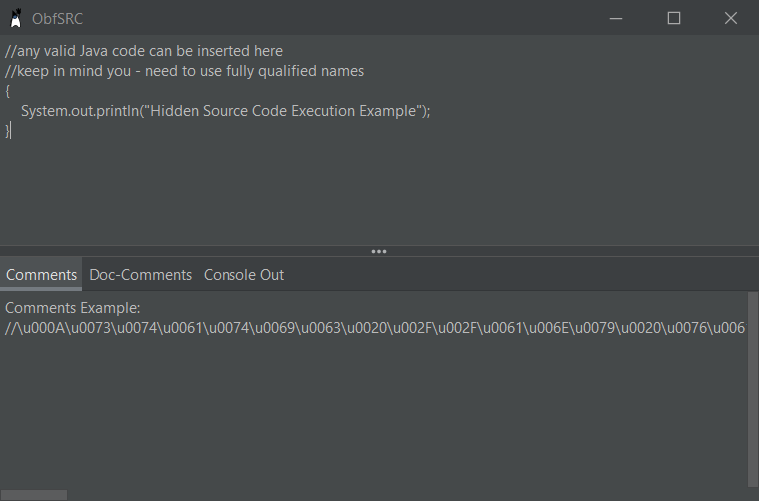

# ObfSRC
ObfSRC is an experimental way to obfuscate Java source code through unicode escaping.



## 💡 How Does This Work?
The Java-Compiler will automatically attempt to decode the escaped unicode, as a result the String turns into raw source code, rather than being defined in the scope of a String.
Comments turn into raw source code, nothing is contained within the defined scope, I'm assuming the unicode decoding process happens very early in the parsing of the Java source file.

## 📚 Links
* [Website](https://konloch.com/ObfSRC/)
* [Discord Server](https://discord.gg/aexsYpfMEf)

## ⚙️ How To Use
### Step 1) Generate the obfuscated source code:
+ The easiest way to do this is to [download the gui](https://github.com/Konloch/ObfSRC/releases/tag/v1.1.0).
+ Alternatively, an API is provided - look at [the example here](https://github.com/Konloch/ObfSRC/blob/main/src/test/java/com/konloch/TestObfSRC.java).

### Step 2) Insert the obfuscated source code
Once you have generated the payload, you can insert it into any class. Depending on the scope you choose, you could execute before the main function has been called.

#### Execute code hidden in comments
```java
//\u000A\u0073\u0074\u0061\u0074\u0069\u0063\u0020\u002F\u002F\u0061\u006E\u0079\u0020\u0076\u0061\u006C\u0069\u0064\u0020\u004A\u0061\u0076\u0061\u0020\u0063\u006F\u0064\u0065\u0020\u0063\u0061\u006E\u0020\u0062\u0065\u0020\u0069\u006E\u0073\u0065\u0072\u0074\u0065\u0064\u0020\u0068\u0065\u0072\u0065\u000D\u000A\u002F\u002F\u006B\u0065\u0065\u0070\u0020\u0069\u006E\u0020\u006D\u0069\u006E\u0064\u0020\u0079\u006F\u0075\u0020\u002D\u0020\u006E\u0065\u0065\u0064\u0020\u0074\u006F\u0020\u0075\u0073\u0065\u0020\u0066\u0075\u006C\u006C\u0079\u0020\u0071\u0075\u0061\u006C\u0069\u0066\u0069\u0065\u0064\u0020\u006E\u0061\u006D\u0065\u0073\u000D\u000A\u007B\u000D\u000A\u0020\u0020\u0020\u0020\u0053\u0079\u0073\u0074\u0065\u006D\u002E\u006F\u0075\u0074\u002E\u0070\u0072\u0069\u006E\u0074\u006C\u006E\u0028\u0022\u0048\u0069\u0064\u0064\u0065\u006E\u0020\u0053\u006F\u0075\u0072\u0063\u0065\u0020\u0043\u006F\u0064\u0065\u0020\u0045\u0078\u0065\u0063\u0075\u0074\u0069\u006F\u006E\u0020\u0045\u0078\u0061\u006D\u0070\u006C\u0065\u0022\u0029\u003B\u000D\u000A\u007D\u002F\u002F
```

#### Execute code before the main method is called
```java
public static final String unicodeFilter = "\u0022\u003B\u0073\u0074\u0061\u0074\u0069\u0063\u0020\u002F\u002F\u0061\u006E\u0079\u0020\u0076\u0061\u006C\u0069\u0064\u0020\u004A\u0061\u0076\u0061\u0020\u0063\u006F\u0064\u0065\u0020\u0063\u0061\u006E\u0020\u0062\u0065\u0020\u0069\u006E\u0073\u0065\u0072\u0074\u0065\u0064\u0020\u0068\u0065\u0072\u0065\u000D\u000A\u002F\u002F\u006B\u0065\u0065\u0070\u0020\u0069\u006E\u0020\u006D\u0069\u006E\u0064\u0020\u0079\u006F\u0075\u0020\u002D\u0020\u006E\u0065\u0065\u0064\u0020\u0074\u006F\u0020\u0075\u0073\u0065\u0020\u0066\u0075\u006C\u006C\u0079\u0020\u0071\u0075\u0061\u006C\u0069\u0066\u0069\u0065\u0064\u0020\u006E\u0061\u006D\u0065\u0073\u000D\u000A\u007B\u000D\u000A\u0020\u0020\u0020\u0020\u0053\u0079\u0073\u0074\u0065\u006D\u002E\u006F\u0075\u0074\u002E\u0070\u0072\u0069\u006E\u0074\u006C\u006E\u0028\u0022\u0048\u0069\u0064\u0064\u0065\u006E\u0020\u0053\u006F\u0075\u0072\u0063\u0065\u0020\u0043\u006F\u0064\u0065\u0020\u0045\u0078\u0065\u0063\u0075\u0074\u0069\u006F\u006E\u0020\u0045\u0078\u0061\u006D\u0070\u006C\u0065\u0022\u0029\u003B\u000D\u000A\u007D\u002F\u002F";
```

#### Execute code hidden as a different method
```java
System.out.println("\u0022\u0029\u003B\u002F\u002F\u0061\u006E\u0079\u0020\u0076\u0061\u006C\u0069\u0064\u0020\u004A\u0061\u0076\u0061\u0020\u0063\u006F\u0064\u0065\u0020\u0063\u0061\u006E\u0020\u0062\u0065\u0020\u0069\u006E\u0073\u0065\u0072\u0074\u0065\u0064\u0020\u0068\u0065\u0072\u0065\u000D\u000A\u002F\u002F\u006B\u0065\u0065\u0070\u0020\u0069\u006E\u0020\u006D\u0069\u006E\u0064\u0020\u0079\u006F\u0075\u0020\u002D\u0020\u006E\u0065\u0065\u0064\u0020\u0074\u006F\u0020\u0075\u0073\u0065\u0020\u0066\u0075\u006C\u006C\u0079\u0020\u0071\u0075\u0061\u006C\u0069\u0066\u0069\u0065\u0064\u0020\u006E\u0061\u006D\u0065\u0073\u000D\u000A\u007B\u000D\u000A\u0020\u0020\u0020\u0020\u0053\u0079\u0073\u0074\u0065\u006D\u002E\u006F\u0075\u0074\u002E\u0070\u0072\u0069\u006E\u0074\u006C\u006E\u0028\u0022\u0048\u0069\u0064\u0064\u0065\u006E\u0020\u0053\u006F\u0075\u0072\u0063\u0065\u0020\u0043\u006F\u0064\u0065\u0020\u0045\u0078\u0065\u0063\u0075\u0074\u0069\u006F\u006E\u0020\u0045\u0078\u0061\u006D\u0070\u006C\u0065\u0022\u0029\u003B\u000D\u000A\u007D\u002F\u002F");
```

#### Examples of the above functions have been included in this test class
[Click here](https://github.com/Konloch/ObfSRC/blob/main/src/test/java/com/konloch/TestObfSRCImpl.java) to view the implementation of these functions.

## 👨‍💻 Disclaimer
+ This is just an experiment to showcase a neat feature in the Java compiler.
+ This **doesn't obfuscate any of the bytecode**, the compiled class will show clearly what you are trying to hide.
+ Oddly enough **Intellij/Eclipse treat these entirely as Strings/Comments/Whatever you're hiding it as**, however, I'm sure there is some option to change that.
+ JShell and other interpreters won't be vulnerable to this, it seems to be a compiler specific issue.
